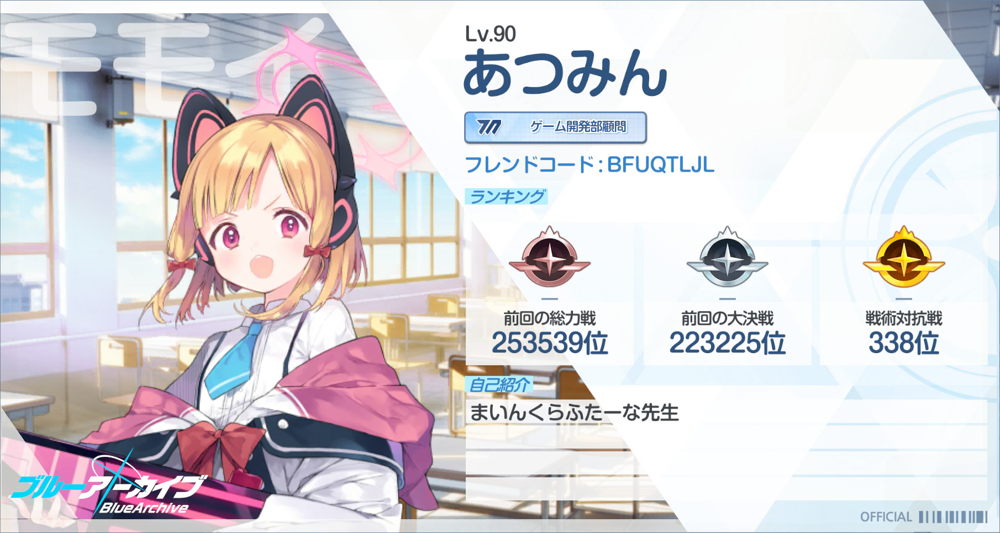

Language: 　**English**　|　[日本語](./README_jp.md)

# FiguraBlueArchiveCharacters
This is the avatars for [Figura](https://modrinth.com/mod/figura), the skin mod for [Minecraft](https://www.minecraft.net/en-us) Java Edition, which are imitated characters who appear in "[Blue Archive](https://bluearchive.jp/)" the game for mobile devices.

Target figura version: [0.1.2](https://modrinth.com/mod/figura/version/0.1.2+1.20.1)

**This branch (base) is a generic avatar created to make a new character easily. Please move to a specific character branch from "[Creation status](#creation-status)" section below.**

## Creation status
### Done
The avatars for these characters are completed. Click on a character's name to go to the character's branch.

- [Shizuko Kawawa](https://github.com/Gakuto1112/FiguraBlueArchiveCharacters/tree/Shizuko)
- [Izuna Kuda](https://github.com/Gakuto1112/FiguraBlueArchiveCharacters/tree/Izuna)
- [Marie Iochi](https://github.com/Gakuto1112/FiguraBlueArchiveCharacters/tree/Marie)
- [Momoi Saiba](https://github.com/Gakuto1112/FiguraBlueArchiveCharacters/tree/Momoi)
- [Midori Saiba](https://github.com/Gakuto1112/FiguraBlueArchiveCharacters/tree/Midori)
- [Shiroko Sunaookami](https://github.com/Gakuto1112/FiguraBlueArchiveCharacters/tree/Shiroko)
- [Hoshino Takanashi](https://github.com/Gakuto1112/FiguraBlueArchiveCharacters/tree/Hoshino) (*1)

*1: The swimsuit costume is not implemented now. It will be implemented later. Be patient.

### In progress
The avatars for these characters are worked in progress. It usually takes about 2~3 weeks. Click on the link in brackets to go to the issue about the character, where you can check the progress.

(There are no avatars currently being created.)

### Planned
Although the avatars for these characters are not created, there are plans to create them in the future. They will be created in order from top to bottom. This is just a plan and the order may change or creation may be discontinued.

- Serika Kuromi（[#37](https://github.com/Gakuto1112/FiguraBlueArchiveCharacters/issues/37)）
- Serina Sumi（[#38](https://github.com/Gakuto1112/FiguraBlueArchiveCharacters/issues/38)）
- Hihumi Ajitani（[#39](https://github.com/Gakuto1112/FiguraBlueArchiveCharacters/issues/39)）

## Features
- Imitated ex skill cut-ins.

  

- An object remains after the ex skill if the ex skill type is "leaving something in a place".
  - The object doesn't affect the game at all.
  - The object will be remove when the hit boxes of a block and it are overlapped.
  - You can also remove the object by right-clicking the action of the ex skill.

  

- Press cursor keys (↑→↓←) to show speech bubbles.
  - The "reload" speech bubble will appear automatically while loading a crossbow.

  

  

- Holds the character's specific weapon instead of bows and crossbows. Shoots bullets instead of arrows.
  - Note that these changes are only in appearance. You are just shooting arrows in actual.

  

- A barrier will applied when the player has absorption hearts (yellow hearts).

  

- Will be rescued by the helicopter when the player dies.
  - This animation won't visible if the player isn't visible because of Minecraft and Figura specifications.

  

- Can change costume if the character has multiple costumes.

  

- Can change your display name to the character's name.
  - Can also display the club name which the character is participated in.
  - **Other players also need to install Figura and give enough permissions** to see your display name.

  

- A cake emoji will be added during the student's birthday.
  - It won't be displayed if the display name is the player name.

  

## The action wheel
Figura provides the action wheel with which players can play some actions (emotes, animations, configs, and etc.). It will be shown when holding the action wheel key (default is B key). This avatar also has some actions.

### Action 1. Ex skill
Plays the ex skill animation. Only in the third person view.

**Notes about Ex skill animations**
- Ex skill animations are designed for the case where the screen ratio is 16:9. Although you can play them in a screen ratio other than 16:9, but some parts may be crowded out of the screen.
- Ex skill animations are design for the case where the field of view (FOV) is standard (70). The FOV will be temporarily adjusted to the standard if it is not standard. However, use of some other mods or FOV changes because of changes of the player's movement speed prevents the script from adjusting it.

### Action 2. Change costume
Changes costume if the character has multiple costumes. Scroll to select the costume and closing the action wheel to confirm. Left-click to reset to current selection, and right-clock to reset to default during selection.

### Action 3. Change display name
Changes the player's display name. Scroll to select the name and closing the action wheel to confirm. Left-click to reset to current selection, and right-clock to reset to default during selection. However, **Other players also need to install Figura and give enough permissions** to see your display name.

### Action 4. Toggle armors visible
Toggles whether equipped armors are visible or not. Some costumes will be hidden not to interfere with the armors while equips them. This setting will only affects to vanilla armors.

I recommend to hide armors because they hide the avatar.

### Action 5. Change accuracy of camera during ex skill animations
Changes the accuracy of the camera collision detection used during ex skill animations. Increasing the accuracy reduces camera wobble but increases the processing load. Scroll to select the option and closing the action wheel to confirm. Left-click to reset to current selection, and right-clock to reset to default during selection.

## How to use
Figura is available in [Forge](https://files.minecraftforge.net/net/minecraftforge/forge/), [Fabric](https://fabricmc.net/), and [Quilt](https://quiltmc.org/).

1. Install the mod loader which you want to use and make the mods available.
2. Install [Figura](https://modrinth.com/mod/figura). Note the mod dependencies.
3. Go to the download page for the character which you want to download.
4. Click green "**<>Code**" button at the top of this page and "**Download ZIP**" to download the repository files.
   - If you cannot find the button. Go back to [the top page of this repository](https://github.com/Gakuto1112/FiguraBlueArchiveCharacters) and go to the desired branch again.
   - If you are familiar with Git, you can also download them by cloning this repository.
5. Extract the file if it is a zipped file.
6. Put avatar files at `<minecraft_instance_directory>/figura/avatars/`.
   - The directory will automatically generated after launching the game with Figura installed. You can also create it manually if it doesn't exist.
7. Open the Figura menu (Δ mark) from the game menu.
8. Select the avatar from the avatar list at the left of the Figura menu.
9. Sets your permission if you need.
10. Other Figura players can see your avatar after uploading your avatar to the Figura server.

## Notes
- I'm not responsible for any damages caused by using this avatar.
- This avatar is designed for work with no resource pack and no other mods are installed. An unexpected issue may occurs when you use it with any resource packs and mods (texture and armor inconsistencies, etc.). However, I won't support in these cases.
- There may be a bug which occurs in multiplayer because my ([Gakuto1112](https://github.com/Gakuto1112)) multiplayer environment to verify the avatar is insufficient.
- Please [report an issue](https://github.com/Gakuto1112/FiguraBlueArchiveCharacters/issues) if you find it.
- Please contact me via [Discussions](https://github.com/Gakuto1112/FiguraBlueArchiveCharacters/discussions) or [Discord](https://discord.com/) if you want to do for my avatars. My Discord name is "vinny_san" and display name is "ばにーさん". My display name in [Figura Discord server](https://discord.gg/figuramc) is "BunnySan/ばにーさん".

---

