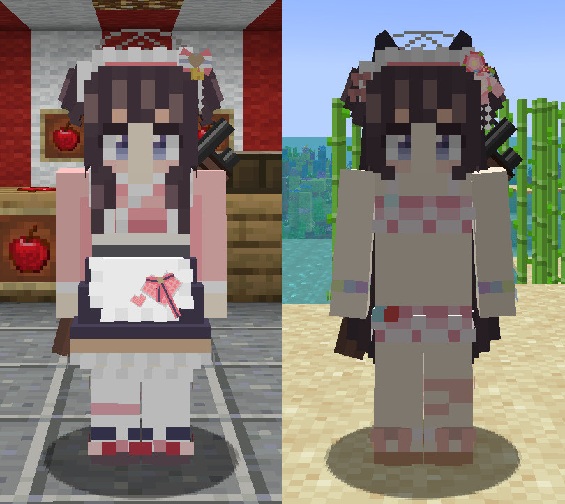

Language: 　**English**　|　[日本語](./README_jp.md)

# FiguraBlueArchiveCharacters
This is the avatars for [Figura](https://modrinth.com/mod/figura), the skin mod for [Minecraft](https://www.minecraft.net/en-us), which are imitated characters who appears in "[Blue Archive](https://bluearchive.jp/)" the game for mobile devices.

Target figura version: [0.1.2](https://modrinth.com/mod/figura/version/0.1.2+1.20.1)

**This branch (base) is a generic avatar created to make a new character easily. Please move to a specific character branch from "[Creation status](#creation-status)" section below.**

## Creation status
### Done
- [Shizuko Kawawa](https://github.com/Gakuto1112/ShizukoPrototype/tree/Shizuko)

### In progress
None

## Features
- Imitated ex skill cut-ins.

  

- An object remains after the ex skill if the ex skill type is "leaving something in a place".
  - The object doesn't affect the game at all.
  - The object will be remove when the hit boxes of a block and it are overlapped.
  - You can also remove the object by right-clicking the action of the ex skill.

  

- Holds the character's specific weapon instead of bows and crossbows. Shoots bullets instead of arrows.
  - Note that these changes are only in appearance. You are just shooting arrows in actual.

  

- Can change costume if the character has multiple costumes.

  

- Can change your display name to the character's name.
  - Can also display the club name which the character is participated in.
  - **Other players also need to install Figura and give enough permissions** to see your display name.

  