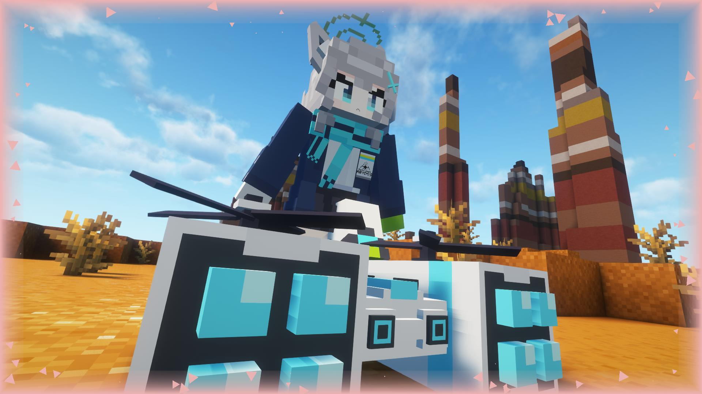
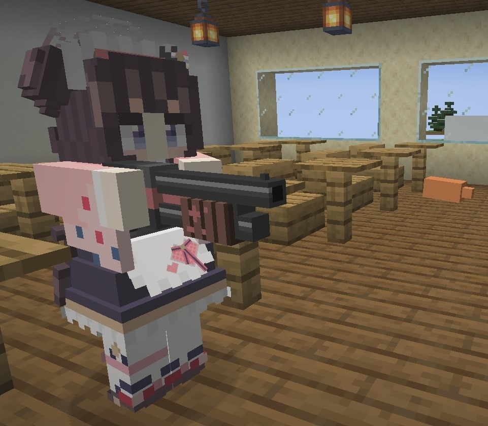
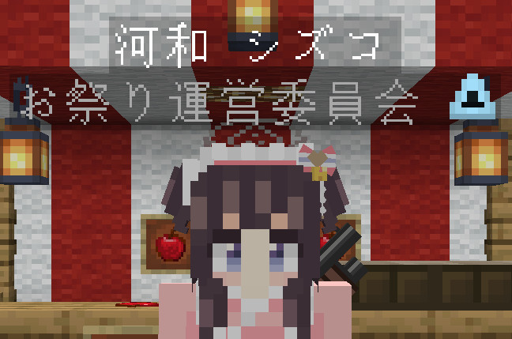

Language: 　**English**　|　[日本語](./README_jp.md)

# FiguraBlueArchiveCharacters
This is the avatars for [Figura](https://modrinth.com/mod/figura), the skin mod for [Minecraft](https://www.minecraft.net/en-us), which are imitated characters who appears in "[Blue Archive](https://bluearchive.jp/)" the game for mobile devices.

Target figura version: [0.1.2](https://modrinth.com/mod/figura/version/0.1.2+1.20.1)

**This branch (base) is a generic avatar created to make a new character easily. Please move to a specific character branch from "[Creation status](#creation-status)" section below.**

## Creation status
### Done
- [Shizuko Kawawa](https://github.com/Gakuto1112/ShizukoPrototype/tree/Shizuko)

### In progress
None

## Features
- Imitated ex skill cut-ins.

  

- An object remains after the ex skill if the ex skill type is "leaving something in a place".
  - The object doesn't affect the game at all.
  - The object will be remove when the hit boxes of a block and it are overlapped.
  - You can also remove the object by right-clicking the action of the ex skill.

  

- Holds the character's specific weapon instead of bows and crossbows. Shoots bullets instead of arrows.
  - Note that these changes are only in appearance. You are just shooting arrows in actual.

  

- Can change costume if the character has multiple costumes.

  

- Can change your display name to the character's name.
  - Can also display the club name which the character is participated in.
  - **Other players also need to install Figura and give enough permissions** to see your display name.

  

## The action wheel
Figura provides the action wheel with which players can play some actions (emotes, animations, configs, and etc.). It will be shown when holding the action wheel key (default is B key). This avatar also has some actions.

### Action 1. Ex skill
Plays the ex skill animation. Only in the third person view.

### Action 2. Change costume
Changes costume if the character has multiple costumes. Scroll to select the costume and closing the action wheel to confirm. Left-click to reset to current selection, and right-clock to reset to default during selection.

### Action 3. Change display name
Changes the player's display name. Scroll to select the name and closing the action wheel to confirm. Left-click to reset to current selection, and right-clock to reset to default during selection. However, **Other players also need to install Figura and give enough permissions** to see your display name.

### Action 4. Toggle armors visible
Toggles whether equipped armors are visible or not. Some costumes will be hidden not to interfere with the armors while equips them. This setting will only affects to vanilla armors.

I recommend to hide armors because they hide the avatar.

## How to use
Figura is available in [Forge](https://files.minecraftforge.net/net/minecraftforge/forge/), [Fabric](https://fabricmc.net/), and [Quilt](https://quiltmc.org/).

1. Install the mod loader which you want to use and make the mods available.
2. Install [Figura](https://modrinth.com/mod/figura). Note the mod dependencies.
3. Go to the download page for the character which you want to download.
4. Click green "**<>Code**" button at the top of the page and "**Download ZIP**" to download the repository files (or clone this repository).
5. Extract the file if it is a zipped file.
6. Put avatar files at `<minecraft_instance_directory>/figura/avatars/`.
   - The directory will automatically generated after launching the game with Figura installed. You can also create it manually if it doesn't exist.
7. Open the Figura menu (Δ mark) from the game menu.
8. Select the avatar from the avatar list at the left of the Figura menu.
9. Sets your permission if you need.
10. Other Figura players can see your avatar after uploading your avatar to the Figura server.

## Notes
- I'm not responsible for any damages caused by using this avatar.
- This avatar is designed for work with no resource pack and no other mods are installed. An unexpected issue may occurs when you use it with any resource packs and mods (texture and armor inconsistencies, etc.). However, I won't support in these cases.
- Please [report an issue](https://github.com/Gakuto1112/FiguraBlueArchiveCharacters/issues) if you find it.