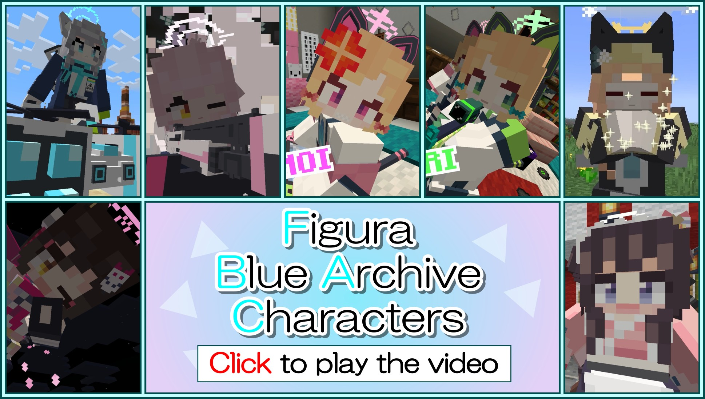

Language: 　**English**　|　[日本語](./README_jp.md)

# FiguraBlueArchiveCharacters
This is the avatars for [Figura](https://modrinth.com/mod/figura), the skin mod for [Minecraft](https://www.minecraft.net/en-us), which are imitated characters who appears in "[Blue Archive](https://bluearchive.jp/)" the game for mobile devices.

Target figura version: [0.1.2](https://modrinth.com/mod/figura/version/0.1.2+1.20.1)

**This branch (base) is a generic avatar created to make a new character easily. Please move to a specific character branch from "[Creation status](#creation-status)" section below.**

## Creation status
### Done
- [Shizuko Kawawa](https://github.com/Gakuto1112/ShizukoPrototype/tree/Shizuko)

### In progress
None