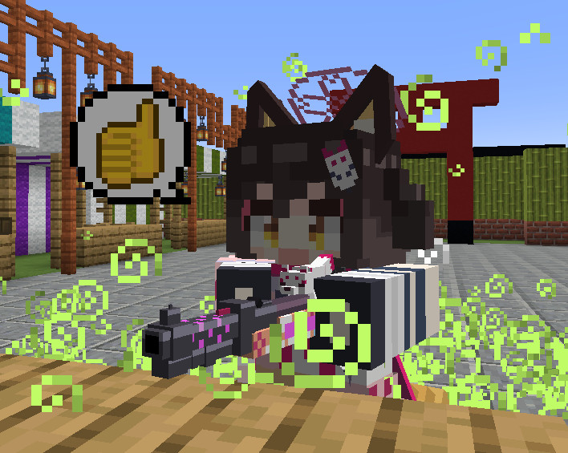
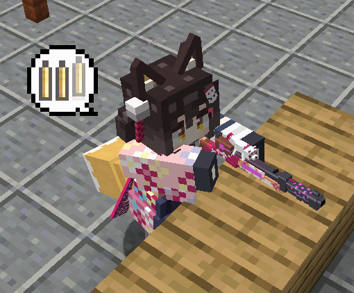
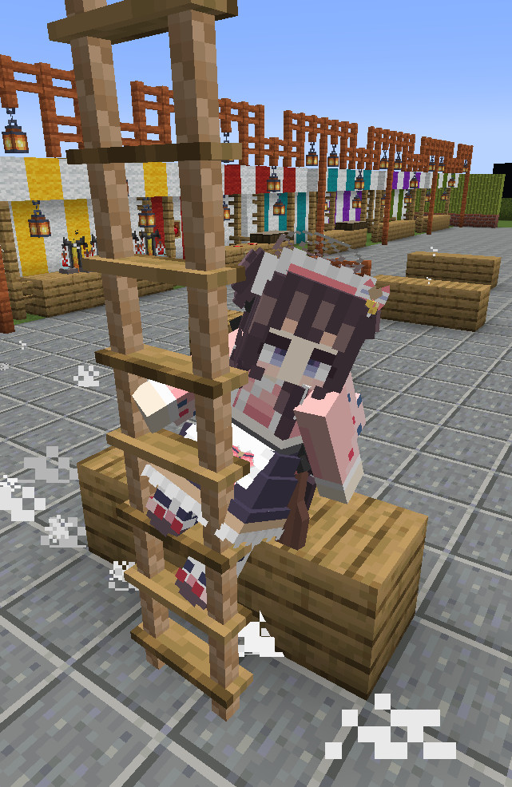
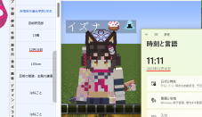
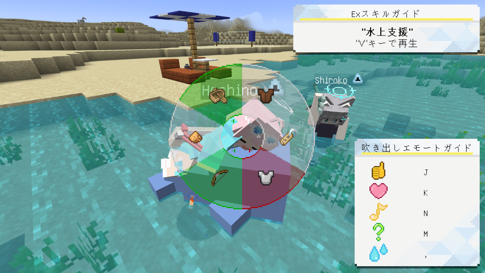

言語: 　[English](./README.md)　|　**日本語**

# FiguraBlueArchiveCharacters
スマートフォンゲーム「[ブルーアーカイブ](https://bluearchive.jp/)」に登場するキャラクターを再現した、MinecraftのスキンMod「[Figura](https://modrinth.com/mod/figura)」で使用できるアバターデータです。

ターゲットFiguraバージョン：[0.1.2](https://modrinth.com/mod/figura/version/0.1.2+1.20.1)

このブランチは**小鳥遊 ホシノ**のブランチです。

## 作成状況
### 作成済み
これらのキャラクターのアバターは完成しました。キャラクターの名前をクリックするとそのキャラクターのブランチに移動できます。

- [河和 シズコ](https://github.com/Gakuto1112/FiguraBlueArchiveCharacters/tree/Shizuko)
- [久田 イズナ](https://github.com/Gakuto1112/FiguraBlueArchiveCharacters/tree/Izuna)
- [伊落 マリー](https://github.com/Gakuto1112/FiguraBlueArchiveCharacters/tree/Marie)
- [才羽 モモイ](https://github.com/Gakuto1112/FiguraBlueArchiveCharacters/tree/Momoi)
- [才羽 ミドリ](https://github.com/Gakuto1112/FiguraBlueArchiveCharacters/tree/Midori)
- [砂狼 シロコ](https://github.com/Gakuto1112/FiguraBlueArchiveCharacters/tree/Shiroko)
- [小鳥遊 ホシノ](https://github.com/Gakuto1112/FiguraBlueArchiveCharacters/tree/Hoshino)（※1）

※1: 現在、水着衣装は実装されていません。後程実装します。しばらくお待ちください。

### 作成中
これらのキャラクターのアバターは作成中です。通常2~3週間程要します。括弧内のリンクをクリックすると対象のissueに移動でき、そこで進捗を確認できます。

（現在作成中のアバターはありません。）

### 作成予定
これらのキャラクターのアバターは作成していないものの、今後作成する予定です。上から順に作成予定です。これはあくまでも予定であり、順番が変更されたり作成を中止したりする可能性があります。

- 黒見 セリカ（[#37](https://github.com/Gakuto1112/FiguraBlueArchiveCharacters/issues/37)）
- 鷲見 セリナ（[#38](https://github.com/Gakuto1112/FiguraBlueArchiveCharacters/issues/38)）
- 阿慈谷 ヒフミ（[#39](https://github.com/Gakuto1112/FiguraBlueArchiveCharacters/issues/39)）

## 特徴
- Exスキルのカットインを再現しています。

  

- 「場に何かを残す」タイプのスキルの場合、Exスキルアニメーション後にオブジェクトが残り続けます。
  - ゲームには一切影響を与えません。
  - オブジェクトとブロックの当たり判定が重なった時に、そのオブジェクトは消えます。
  - Exスキルのアクションを右クリックでもオブジェクトを消せます。

  

- 弓やクロスボウの代わりに生徒固有の武器を構えます。矢の代わりに銃弾が発射されます。
  - 変化するのは見た目だけであり、実際はただ矢を撃っているだけなのでご注意下さい。

  

- カーソルキー（↑→↓←）で吹き出しを表示できます。
  - クロスボウに装填中は自動で装填の吹き出しが表示されます。

  

  

- 衝撃吸収のハート（黄色のハート）を持っている場合は、バリアが付きます。

  

- プレイヤーが死ぬとヘリコプターで回収されます。
  - MinecraftやFiguraの仕様上、プレイヤーが表示されていないとこのアニメーションが表示されません。

  

- 生徒に衣装違いがあれば、衣装変更が可能であり、衣装によって再生されるExスキルも異なります。

  

- プレイヤーの名前を生徒の名前にすることができます。
  - 部活名を表示することもできます。
  - 他のプレイヤーがこの名前を見えるようにするには、**他のプレイヤーもFiguraを導入し、他のプレイヤー側であなたに対する信頼設定を十分上げる必要があります。**

  

- 生徒の誕生日には（ささやかながら）名前にケーキマークが付きます。
  - 表示名がプレイヤー名である場合は表示されません。

  

## アクションホイール
Figuraには、アクションホイールキー（デフォルトは「B」キー）を押すことで、エモートなどを実行できるリングメニューが実装されています。このレポジトリのアバターには共通したアクションが用意されています。

### アクション1. Exスキル
Exスキルアニメーションを再生します。三人称視点でのみ再生できます。

**Exスキルアニメーションに関する注意事項**
- Exスキルアニメーションは画面比率が16:9の場合を想定して作られています。16:9以外の画面比率でもExスキルアニメーションは再生できますが、見切れる可能性があります。
- Exスキルアニメーションは視野（FOV）が標準（70）である場合を想定して作られています。標準以外の場合でExスキルアニメーションを再生すると一時的に視野が標準になるよう補正されます。ただし、一部のmodの同時使用や移動速度の変化による視野の変化の場合は正常な補正がされません。

### アクション2. 衣装変更
衣装違いがあれば衣装を変更できます。スクロールで衣装を変更し、アクションホイールを閉じると確定します。選択中に左クリックをすると現在の設定値に、右クリックすると初期値にリセットされます。

### アクション3. 名前変更
プレイヤーの表示名を変更します。スクロールで表示名を選択し、アクションホイールを閉じると確定します。選択中に左クリックをすると現在の設定値に、右クリックすると初期値にリセットされます。ただし、他のプレイヤーが変更された名前を見るには、**そのプレイヤーもFiguraを導入し、他のプレイヤー側であなたに対する信頼設定を十分上げる必要があります。**

### アクション4. 防具の表示の切り替え
防具を表示するかどうかを設定できます。ただし、折角のアバターが隠れてしまうので、防具を非表示にすることをお勧めします。

### アクション5. Exスキルアニメーション中のカメラワークの精度の変更
Exスキルアニメーション中に使用されるカメラの当たり判定の検出の精度を変更します。精度を高くするとカメラのがたつきが軽減される一方で処理の負荷が増加します。スクロールで精度を変更し、アクションホイールを閉じると確定します。選択中に左クリックをすると現在の設定値に、右クリックすると初期値にリセットされます。

## 使用方法
Figuraは[Forge](https://files.minecraftforge.net/net/minecraftforge/forge/)、[Fabric](https://fabricmc.net/)、[Quilt](https://quiltmc.org/)に対応しています。

1. 使用したいModローダーをインストールし、Modを使用できる状態にします。
2. [Figura](https://modrinth.com/mod/figura)を追加します。Modの依存関係にご注意ください。
3. 使用したいキャラクターのダウンロードページに移動します。
4. ページ上部の緑色のボタン「**Code**」から「**Download ZIP**」からこのレポジトリのファイルをダウンロードします。（または、このレポジトリをクローンします。）
5. 圧縮ファイルの場合は展開します。
6. `<マインクラフトのゲームフォルダ>/figura/avatars/`にアバターのデータを配置します。
   - Figuraを導入した状態で一度ゲームを起動すると自動的に作成されます。存在しない場合は手動での作成も可能です。
7. ゲームメニューからFiguraメニュー（Δマーク）を開きます。
8. 画面左のアバターリストからアバターを選択します。
9. 必要に応じて権限設定をして下さい。
10. アバターをサーバーにアップロードすると、他のFiguraプレイヤーもあなたのアバターを見ることができます。

## 注意事項
- このアバターを使用して発生した、いかなる損害の責任も負いかねます。
- このアバターは、デフォルトのリソースパックでの動作を想定しています。また、他MODの使用は想定していません。想定動作環境外ではテクスチャの不整合、防具が表示されない/非表示にならない、といった不具合が想定されます。この場合の不具合は対応しませんのでご了承下さい。
- 私（[Gakuto1112](https://github.com/Gakuto1112)）のマルチプレイで動作検証を行う環境が不十分である為、マルチプレイにおいて発生する不具合がある可能性があります。
- 不具合がありましたら、[Issues](https://github.com/Gakuto1112/FiguraBlueArchiveCharacters/issues)までご連絡下さい。
- アバター関係で私に連絡したい方は[Discussions](https://github.com/Gakuto1112/FiguraBlueArchiveCharacters/discussions)または、[Discord](https://discord.com/)でご連絡下さい。私のDiscordのアカウント名は「vinny_san」で表示名は「ばにーさん」です。[FiguraのDiscordサーバー](https://discord.gg/figuramc)での表示名は「BunnySan/ばにーさん」です。

---

