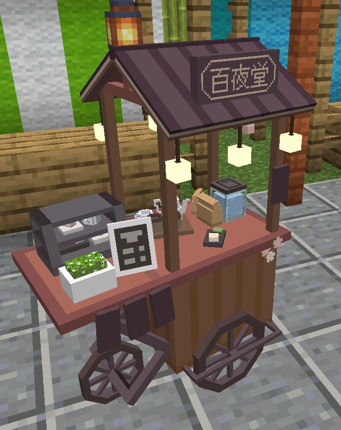

<!-- $inject(locale_link) -->

# FiguraBlueArchiveCharacters
This is the avatars for [Figura](https://modrinth.com/mod/figura), the skin mod for [Minecraft](https://www.minecraft.net/en-us) Java Edition, which are imitated characters who appear in "[Blue Archive](https://bluearchive.jp/)" the game for mobile devices.

Target figura version: [0.1.4](https://modrinth.com/mod/figura/version/0.1.4+1.20.1)

(Some avatar functions don't work correctly in Minecraft 1.20.4 doe to [a bug in Figura](https://github.com/FiguraMC/Figura/issues/197). I recommend using in Minecraft 1.20.1.)

This branch is for **Mari Iochi**.

## Creation status
### Done
The avatars for these characters are completed. Click on a character's name to go to the character's branch.

- [Shizuko Kawawa](https://github.com/Gakuto1112/FiguraBlueArchiveCharacters/tree/Shizuko)
- [Izuna Kuda](https://github.com/Gakuto1112/FiguraBlueArchiveCharacters/tree/Izuna)
- [Mari Iochi](https://github.com/Gakuto1112/FiguraBlueArchiveCharacters/tree/Mari)
- [Momoi Saiba](https://github.com/Gakuto1112/FiguraBlueArchiveCharacters/tree/Momoi)
- [Midori Saiba](https://github.com/Gakuto1112/FiguraBlueArchiveCharacters/tree/Midori)
- [Shiroko Sunaookami](https://github.com/Gakuto1112/FiguraBlueArchiveCharacters/tree/Shiroko)
- [Hoshino Takanashi](https://github.com/Gakuto1112/FiguraBlueArchiveCharacters/tree/Hoshino)

### In progress
The avatars for these characters are worked in progress. It usually takes about 2~3 weeks, but works have been delayed because of my recently busy schedule. Click on the link in brackets to go to the issue about the character, where you can check the progress.

- Momoi Saiba (maid) ([#51](https://github.com/Gakuto1112/FiguraBlueArchiveCharacters/issues/51))
- Midori Saiba (maid) ([#52](https://github.com/Gakuto1112/FiguraBlueArchiveCharacters/issues/52))

### Planned
Although the avatars for these characters are not created, there are plans to create them in the future. They will be created in order from top to bottom. This is just a plan and the order may change or creation may be discontinued.

- Umika Satohama ([#53](https://github.com/Gakuto1112/FiguraBlueArchiveCharacters/issues/53))
- Serika Kuromi ([#37](https://github.com/Gakuto1112/FiguraBlueArchiveCharacters/issues/37))
- Serina Sumi ([#38](https://github.com/Gakuto1112/FiguraBlueArchiveCharacters/issues/38))
- Hihumi Ajitani ([#39](https://github.com/Gakuto1112/FiguraBlueArchiveCharacters/issues/39))

## Features
- Imitated ex skill cut-ins.

  

- An object remains after the ex skill if the ex skill type is "leaving something in a place".
  - The object doesn't affect the game at all.
  - The object will be remove when the hit boxes of a block and it are overlapped.
  - You can also remove the object by right-clicking the action of the ex skill.

  

- Press cursor keys (↑→↓←) to show speech bubbles.
  - The "reload" speech bubble will appear automatically while loading a crossbow.

  

  

- Holds the character's specific weapon instead of bows and crossbows. Shoots bullets instead of arrows.
  - Note that these changes are only in appearance. You are just shooting arrows in actual.

  

- A barrier will applied when the player has absorption hearts (yellow hearts).

  

- Will be rescued by the helicopter when the player dies.
  - This animation won't visible if the player isn't visible because of Minecraft and Figura specifications.

  

- Can change costume if the character has multiple costumes.

  

- Can change your display name to the character's name.
  - Can also display the club name which the character is participated in.
  - **Other players also need to install Figura and give enough permissions** to see your display name.

  

- A cake emoji will be added during the student's birthday.
  - It won't be displayed if the display name is the player name.

  

## Ex Skill
The familiar Ex skill cut-in from the original game is imitated. To play Ex skill cut-in, press the Ex skill key (default is "V" key) while in the **third-person perspective**.

Ex skill cut-ins are only visual and have no effect. However, some Ex skills leave objects in place after the cut-in (also only visual).

> [!NOTE]
> - Ex skill animations are designed for the case where the screen ratio is 16:9. Although you can play them in a screen ratio other than 16:9, but some parts may be crowded out of the screen.
> - Ex skill animations are design for the case where the field of view (FOV) is standard (70). The FOV will be temporarily adjusted to the standard if it is not standard. However, use of some other mods or FOV changes because of changes of the player's movement speed prevents the script from adjusting it.

## The action wheel
Figura provides the action wheel with which players can play some actions (emotes, animations, configs, and etc.). It will be shown when holding the action wheel key (default is B key). This avatar also has some actions.

> [!IMPORTANT]
> The Ex skill action has been changed to play on key press.

### Action 1. Change costume
Changes costume if the character has multiple costumes. Scroll to select the costume and closing the action wheel to confirm. Left-click to reset to current selection, and right-clock to reset to default during selection.

### Action 2. Change display name
Changes the player's display name. Scroll to select the name and closing the action wheel to confirm. Left-click to reset to current selection, and right-clock to reset to default during selection. However, **Other players also need to install Figura and give enough permissions** to see your display name.

### Action 3. Toggle armors visible
Toggles whether equipped armors are visible or not. Some costumes will be hidden not to interfere with the armors while equips them. This setting will only affects to vanilla armors.

I recommend to hide armors because they hide the avatar.

### Action 4. Toggle first-person weapon models
Toggles whether weapon models (including students' guns) are visible or not in first person perspective. If toggled off, Minecraft items will be displayed instead. Regardless of this setting, weapon models are always displayed in third person perspective.

### Action 5. Change amount of Ex skill frame particles
Changes the amount of triangular particles that appear from the red or blue borders that appear during Ex skill animations. Reducing or disabling particles may improve performance.

As an additional option, I have added an option to disable the frame during the Ex skill animations. This is the closest to the original one.

<!-- $inject(how_to_use) -->

<!-- $inject(notes) -->

---

