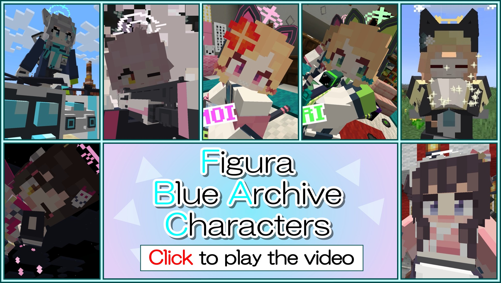

<!-- $inject(locale_link) -->

# FiguraBlueArchiveCharacters
スマートフォンゲーム「[ブルーアーカイブ](https://bluearchive.jp/)」に登場するキャラクターを再現した、MinecraftのスキンMod「[Figura](https://modrinth.com/mod/figura)」で使用できるアバターデータです。

ターゲットFiguraバージョン：[0.1.2](https://modrinth.com/mod/figura/version/0.1.2+1.20.1)

**このブランチ（base）は新たなキャラクターを作成しやすくする目的で作られた汎用アバターとなっています。下の「[作成状況](#作成状況)」から特定のキャラクターのブランチに移動して下さい。**

## 作成状況
### 作成済み
- [河和 シズコ](https://github.com/Gakuto1112/ShizukoPrototype/tree/Shizuko)

### 作成中
- 久田 イズナ

## 特徴
- Exスキルのカットインを再現しています。

  

- 「場に何かを残す」タイプのスキルの場合、Exスキルアニメーション後にオブジェクトが残り続けます。
  - ゲームには一切影響を与えません。
  - オブジェクトとブロックの当たり判定が重なった時に、そのオブジェクトは消えます。
  - Exスキルのアクションを右クリックでもオブジェクトを消せます。

  

- 弓やクロスボウの代わりに生徒固有の武器を構えます。矢の代わりに銃弾が発射されます。
  - 変化するのは見た目だけであり、実際はただ矢を撃っているだけなのでご注意下さい。

  

- 衝撃吸収のハート（黄色のハート）を持っている場合は、バリアが付きます。

  

- プレイヤーが死ぬとヘリコプターで回収されます。
  - MinecraftやFiguraの仕様上、プレイヤーが表示されていないとこのアニメーションが表示されません。

  

- 生徒に衣装違いがあれば、衣装変更が可能であり、衣装によって再生されるExスキルも異なります。

  

- プレイヤーの名前を生徒の名前にすることができます。
  - 部活名を表示することもできます。
  - 他のプレイヤーがこの名前を見えるようにするには、**他のプレイヤーもFiguraを導入し、他のプレイヤー側であなたに対する信頼設定を十分上げる必要があります。**

  

## アクションホイール
Figuraには、アクションホイールキー（デフォルトは「B」キー）を押すことで、エモートなどを実行できるリングメニューが実装されています。このレポジトリのアバターには共通したアクションが用意されています。

### アクション1. Exスキル
Exスキルアニメーションを再生します。三人称視点でのみ再生できます。

### アクション2. 衣装変更
衣装違いがあれば衣装を変更できます。スクロールで衣装を変更し、アクションホイールを閉じると確定します。選択中に左クリックをすると現在の設定値に、右クリックすると初期値にリセットされます。

### アクション3. 名前変更
プレイヤーの表示名を変更します。スクロールで表示名を選択し、アクションホイールを閉じると確定します。選択中に左クリックをすると現在の設定値に、右クリックすると初期値にリセットされます。ただし、他のプレイヤーが変更された名前を見るには、**そのプレイヤーもFiguraを導入し、他のプレイヤー側であなたに対する信頼設定を十分上げる必要があります。**

### アクション4. 防具の表示の切り替え
防具を表示するかどうかを設定できます。ただし、折角のアバターが隠れてしまうので、防具を非表示にすることをお勧めします。

<!-- $inject(how_to_use) -->

<!-- $inject(notes) -->

## アバター作成に必要なもの
画面直撮りはやめて下さい。

- キャラクターイラスト（スクリーンショット等）
  - 見えない部分は想像で補います。
  - 衣装違いなどもあれば一緒に用意して下さい。
- Exスキルのカットイン（画面録画）
  - 倍速は無効にして下さい。
  - スキル使用後の様子も収めて下さい。
  - 戦闘の最初から最後までが収めてあるとアバター作成時に役立つ可能性があります。
  - 衣装違いがあればその分も収めてください。
- 生徒の基本情報（名前、誕生日など）
  - 生徒情報画面の下側にボタンがあります。
- Exスキルの名前（スキル強化の画面）
- 固有武器（固有武器強化の画面）
  - 生徒を★5にしなくてもこの画面は見れます。
- 生徒の初期レアリティ（★1、★2、★3）
  - アバターのサムネイル画像の決定に使います。
- やる気
  - 「作ってやる！」という意欲