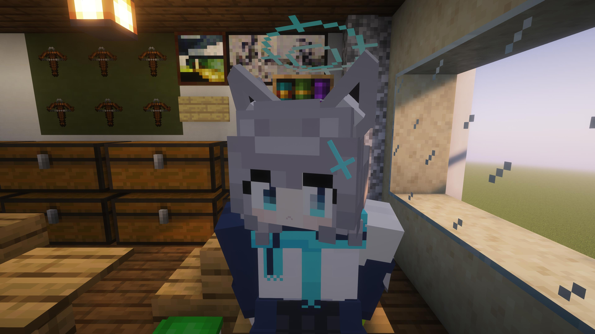
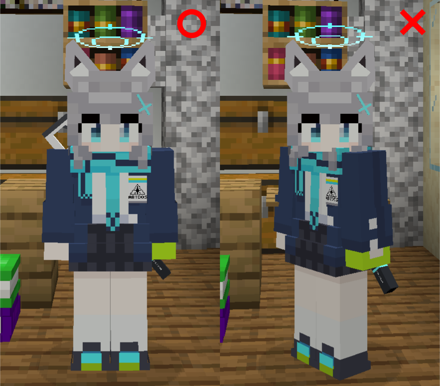

# メモリアルロビーの再現方法
このレポジトリにあるアバターを用いて本家ブルーアーカイブのメモリアルロビーを再現する方法を解説します。



## 準備物
### 必須
（アバターをゲーム内で使用するための準備物は省略します。）
- 再現対象の生徒のアバターモデル
  - メインモデルは勿論のこと、必要であれば武器のモデルも準備します。
  - Exスキルアニメーションは不要です。
- 参考画像（メモリアルロビーのスクリーンショット等）
  - 自ら用意しても構いません。本家で再現対象の生徒を持っていない等で用意できない場合は[Wiki](https://bluearchive.wikiru.jp/)に画像が置いてあるので、そこで用意できます。

### お勧め
- [Optifine](https://optifine.net/downloads)（[Forge](https://files.minecraftforge.net/net/minecraftforge/forge/)向け）　又は　[Iris Shaders](https://modrinth.com/mod/iris)（[Fabric](https://fabricmc.net/)向け、Iris Shaders単体でも使用できます）
  - 共にシェーダー機能が含まれています。影や水面反射等をシミュレートし、よりゲームのグラフィックを向上させます。
  - 実際にシェーダー機能を使用する場合は、別途シェーダーパックを準備する必要があります。
- 任意のシェーダーパック
  - ゲームフォルダ内の`shaderpacks`に入れて下さい。zip圧縮されているままでも大丈夫です。
  - おすすめのシェーダーパックは[Complementary Shaders](https://modrinth.com/shader/complementary-unbound)です。
- [Freecam](https://modrinth.com/mod/freecam)
  - プレイヤーの位置や向きを維持したまま自由にカメラを動かすことができます。ポージング中に別視点からモデルを確認したい場合に便利です。
- [fabrishot](https://modrinth.com/mod/fabrishot)ゲームの解像度よりも大きいスクリーンショットを撮影できます。
  - シェーダーパックを用いる場合、露光時間が必要な場合は、modオプションの`Capture delay`の値を大きくすることで露光時間を確保することができる。

## 手順
1. 背景を準備する。
   - 既にあるものをそのまま流用してもいいし、新たに作ってもよい。
   - 背景の場所は風景や太陽の角度、影ができる向き等から総合的に決定する。
   - 背景を作る場合は、画面に映らない場所はハリボテにしてもよい。ただし、ゲーム内の方が本家メモロビよりも画角が広くなるので注意する。
2. 生徒の立ち位置を決定する。
   - 後の管理を簡単にするため、視点は **視点は真っすぐ水平を見ている状態にする。** なお、以下のコマンドを利用すると簡単に視点を水平にできる。
     ```
     /tp @p ~ ~ ~ ~ 0
     ```
   - **頭と体は同じ向きになるようにする。** 特に、テレポートコマンドは頭の向きを指定できても体の向きは指定できないので注意する。

     

    - テレポート後に体の向きを直したい場合は、視点を動かさずそのまま前進か後退をすれば直る。
    - **ここで決めた立ち位置は今後基本的に変更しない。**
    - `F3`+`C`を押すと現在の立ち位置や向きをクリップボードにコマンド形式で記録できる。このコマンドを実行するとこの位置に戻ってこられる。後々の為に控えておくとよい。
3. ポージングを行う。
   - 腕はスクリプトによって制御されているため、`arms.lua`から以下のコードを削除してスクリプトの制御を解除する。
      ```lua
      ~~~

      else
      models.models.main.Avatar.UpperBody.Arms.RightArm:setParentType("RightArm")
      models.models.main.Avatar.UpperBody.Arms.LeftArm:setParentType("LeftArm")
      for _, modelPart in ipairs({models.models.main.Avatar.UpperBody.Arms.RightArm, models.models.main.Avatar.UpperBody.Arms.LeftArm}) do
          modelPart:setRot()
      end
      events.RENDER:remove("bow_pose_render")

      ~~~
      ```
   - 揺れ物を動かす際は`blue_archive_character.lua`から揺れ物の登録を削除する。
   - ゲーム内でポージングを確認した場合はFreecamの機能を使うとよい。
   - 必要であれば追加のオブジェクトのモデリングや専用リソースパックの制作を行う。作成したリソースパックはアバターと一緒に保存しておく。
4. カメラの位置や向きを決定する。
   - ある程度ポージングが形になったらカメラの位置や向きを探る。 **三人称後方視点にした状態で作業を行う。**
   - `blue_archive_character.lua`の最後にある、「*生徒固有初期化処理*」と書かれた場所に以下のコードを追加し、カメラを制御する。
     ```lua
     renderer:setCameraPos(0, 0, -4)
     renderer:setOffsetCameraRot(0, 180, 0)
     ```
     上記のコードを挿入するとカメラが生徒の頭にめり込んだ状態になるはずである。この状態で、上段の関数の引数を変更するとカメラの位置が、下段の関数の引数を変更するとカメラの向きが変化する。
   - Freecamは上記コードの影響を受けないため、この作業中でも俯瞰視点からモデルを確認できる。
5. シェーダーパックの適用
   - シェーダーパックを使用することで息を吞むような美しい写真を撮ることができる。
   - シェーダーを適用した際に、 **たまにヘイロー（頭の輪っか）が描画されない場合があるので注意する。** アバターを再読み込みすると直るが、割と気付かないので注意する。
   - シェーダーを適用するとヘイローが黄色っぽく描画される場合がある、これは、ヘイローのライティングによる影響である。もし、ヘイローのライティングが不要であれば`head_ring.lua`から以下のコードを削除し、ライティングを無効にする。
     ```lua
     models.models.main.Avatar.Head.HeadRing:setLight(15)
     ```
6. シェーダーパックの設定調整
   - この作業は必須ではないが、上手く設定を調整するとより綺麗な写真を撮ることができる。
   - 作業を行う前に、現在の設定をエクスポートし、控えておく。
   - シェーダーパックの設定はインポートやエクスポートができるので、後で取り直すために設定を控えておく。
7. 撮影
   - ゲームのスクリーンショット機能やFabrishotを用いて撮影を行う。
   - 出力されたスクリーンショットを編集しないのであれば、jpgに変換しておくのがよい。
   - 撮影後はシェーダーパックの設定を元に戻す。

**上記の手順からもわかる通り、メモリアルロビーを再現するために、アバターに破壊的変更を加えます。作業する前に予めアバターのバックアップを取っておいてください。**